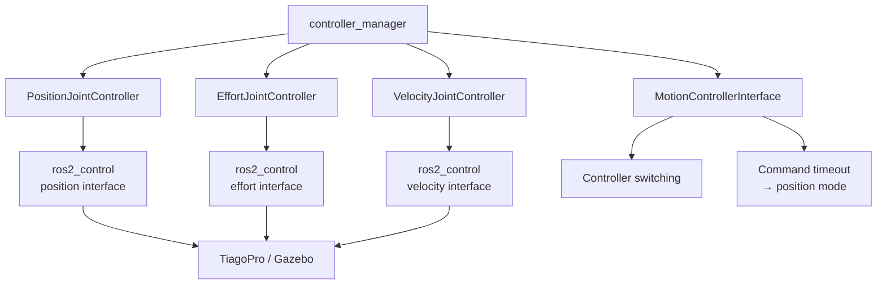

# tiago_pro_joint_controllers

ROS 2 (Humble) `ros2_control` controllers for PAL Robotics' **TiagoPro** arms, providing topic-based position, effort (torque), and velocity control with runtime mode switching and automatic safety fallback.

## 1. Project Overview

TiagoPro's standard `ros2_control` setup requires controller-manager reconfiguration when switching between control modes. This package provides a simpler interface for research and application code:

* Send joint commands directly through ROS 2 topics.
* Switch between **position, effort, and velocity control at runtime**.
* Automatically fall back to **position control** if effort or velocity commands stop arriving.

The package consists of:

* **`position_joint_controller`**, **`effort_joint_controller`**, **`velocity_joint_controller`** — `ControllerInterface` plugins for the three control modes. They receive joint commands through `~/commands` and enforce joint limits and command smoothing/rate limiting.
* **`motion_controller_interface`** — coordinator responsible for switching between controllers through `controller_manager` and triggering the safety fallback.
* **`tiago_pro_joint_controllers_msgs`** — package containing the shared `JointCommand` message.
* **`tiago_pro_joint_controllers`** — meta-package bundling the components above.

The controllers use TiagoPro's 7-DOF arm joint naming convention (`{arm_prefix}1_joint` … `{arm_prefix}7_joint`) and can run with PAL's system stack on the real robot or in Gazebo Classic.

## 2. Data Interface

### Input

The controllers receive joint commands through ROS 2 topics using the shared `JointCommand` message:

| Topic                                    | Type                                                | Purpose                                                                                                    |
| ---------------------------------------- | --------------------------------------------------- | ---------------------------------------------------------------------------------------------------------- |
| `<controller_name>/commands`             | `tiago_pro_joint_controllers_msgs/msg/JointCommand` | Position (`rad`), effort (`N·m`), or velocity (`rad/s`) commands.                                          |
| `<gravity_compensation_topic>`           | `tiago_pro_joint_controllers_msgs/msg/JointCommand` | Optional per-joint gravity-compensation torques (`N·m`).                                                   |
| `<motion_controller_interface>/set_mode` | `std_msgs/msg/Int32`                                | Selects the active control mode: `0` = position, `1` = effort, `2` = velocity, `3` = gravity compensation. |

For a TiagoPro arm, `command` contains 7 values. Incoming commands are validated against the configured joint limits; malformed or out-of-range messages are rejected before reaching the hardware.

### Output

Controllers write directly to the `ros2_control` command interfaces claimed by the active controller:

* `.../effort` — effort control
* `.../position` — position control
* `.../velocity` — velocity control

No separate output topic is required. The command interfaces are consumed by the loaded `hardware_interface::SystemInterface`, such as the TiagoPro hardware driver or Gazebo.

Controller modes are switched by `motion_controller_interface` through the `controller_manager` switch-controller service.

## 3. Software Architecture

All four components are loaded as plugins by `controller_manager`:



### Key points

* **Position, effort, and velocity controllers** independently implement `ControllerInterface` and claim their respective hardware interfaces.
* **`MotionControllerInterface`** does not claim hardware interfaces; it handles runtime mode switching and command-timeout monitoring.
* Commands cross the ROS/non-RT boundary through `RealtimeBuffer` before being processed by the real-time controller loop.
* If effort or velocity commands stop arriving for `command_timeout` (default **0.5 s**), the coordinator switches back to position mode.

## 4. Requirements & Dependencies

### Software

* **ROS 2 Humble**
* **PAL Robotics TiagoPro software stack**
* **Gazebo Classic** — optional, for simulation

The recommended environment is **PAL Robotics' official TiagoPro Docker development image**, which already includes the required ROS 2, `ros2_control`, PAL, and Gazebo dependencies.

Clone this repository into the image's workspace:

```bash
cd ~/workspace/src
git clone <repository-url>
```

On the **real robot**, the TiagoPro description, hardware interface, and `controller_manager` must already be running through PAL's standard system modules. This package provides the controllers and does **not** perform robot bringup.

### Hardware

Either:

* A **TiagoPro** with `controller_manager` already running, or
* A **TiagoPro Gazebo Classic simulation**.

## 5. Getting Started

These instructions assume PAL's TiagoPro Docker image, or an equivalent ROS 2 Humble workspace with the TiagoPro software stack installed.

### Build

```bash
cd ~/humble_ws
colcon build --symlink-install --packages-up-to tiago_pro_joint_controllers
source install/setup.bash
```

### Run — Gazebo Classic

The recommended starting point is the dual-arm, mode-switchable configuration:

```bash
ros2 launch effort_joint_controller multi_controller_gazebo_classic.launch.py
```

Optional:

```bash
# Left arm only
ros2 launch effort_joint_controller multi_controller_gazebo_classic.launch.py arm_side:=left

# Single position controller, right arm
ros2 launch position_joint_controller position_joint_controller_gazebo_classic.launch.py arm_side:=right
```

### Run — Real Robot

The real robot must already have PAL's standard bringup and `controller_manager` running.

```bash
# Recommended: both arms with runtime mode switching
ros2 launch effort_joint_controller multi_controller_real_robot.launch.py
```

For single-controller/debug use:

```bash
# Effort controller
ros2 launch effort_joint_controller effort_joint_controller.launch.py

# Velocity controller, right arm
ros2 launch velocity_joint_controller velocity_joint_controller.launch.py arm_side:=right
```

### Verify

```bash
ros2 control list_controllers
```

The expected controller should report `active`.

### Send a Command

For example, send zero torque to the left-arm effort controller:

```bash
ros2 topic pub --once \
  /arm_left_effort_joint_controller/commands \
  tiago_pro_joint_controllers_msgs/msg/JointCommand \
  "{command: [0.0, 0.0, 0.0, 0.0, 0.0, 0.0, 0.0]}"
```

### Switch Modes

With `motion_controller_interface` running:

```bash
# 0 = position, 1 = effort, 2 = velocity
ros2 topic pub --once \
  /arm_left_motion_controller_interface/set_mode \
  std_msgs/msg/Int32 "{data: 1}"
```

### Testing

There is currently no automated test suite. Changes should be validated manually by:

1. Building the workspace successfully.
2. Running the relevant Gazebo scenario.
3. Checking controller states with `ros2 control list_controllers`.
4. Sending representative `JointCommand` messages.
5. For changes to `motion_controller_interface`, testing mode switching and automatic fallback after `command_timeout`.
